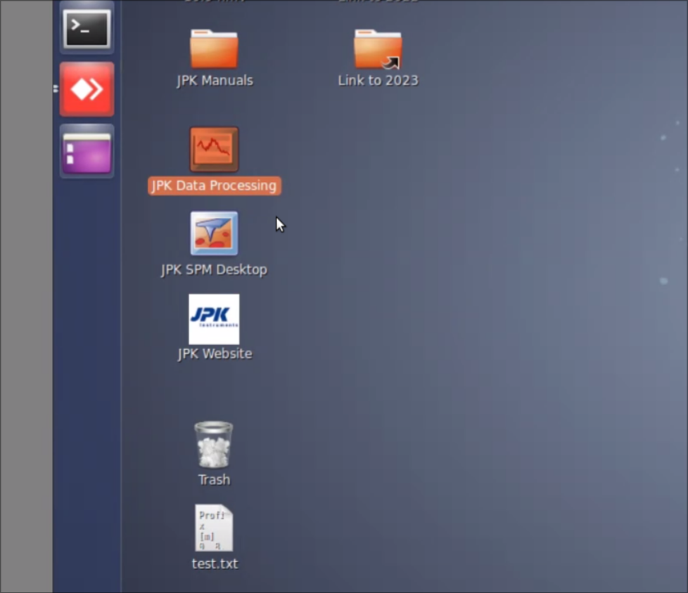
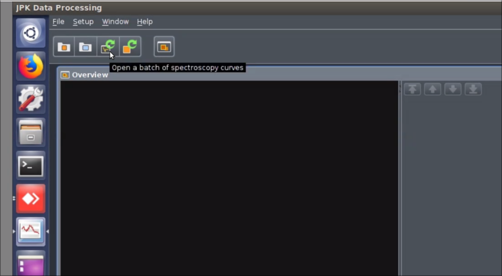
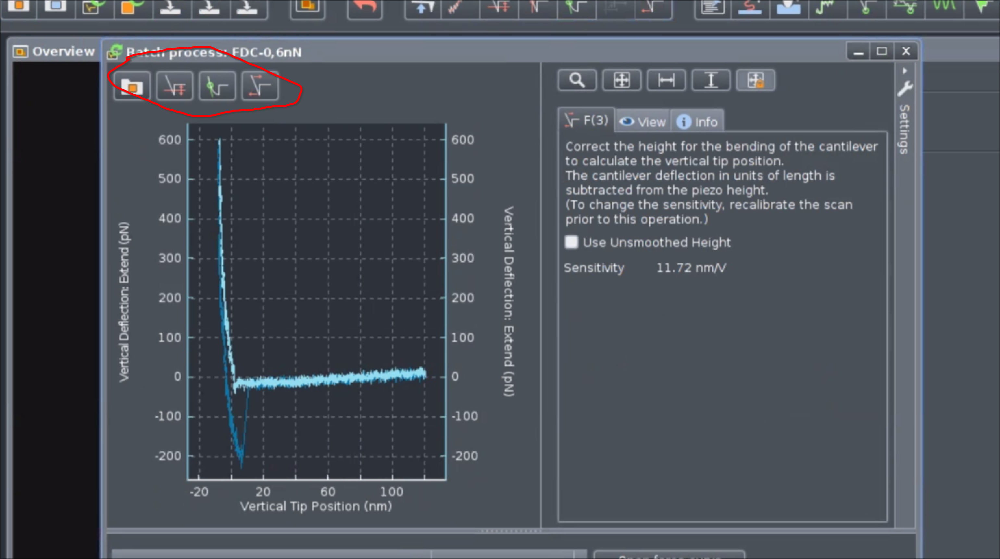
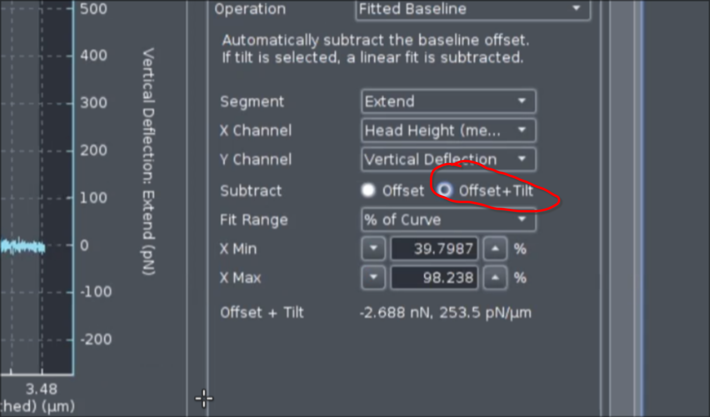
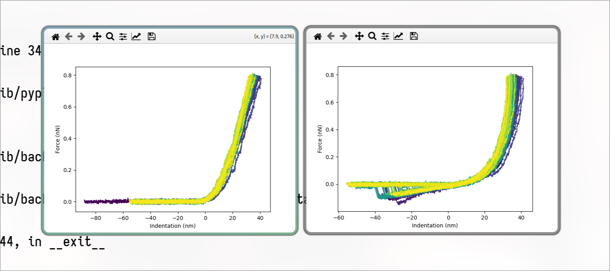
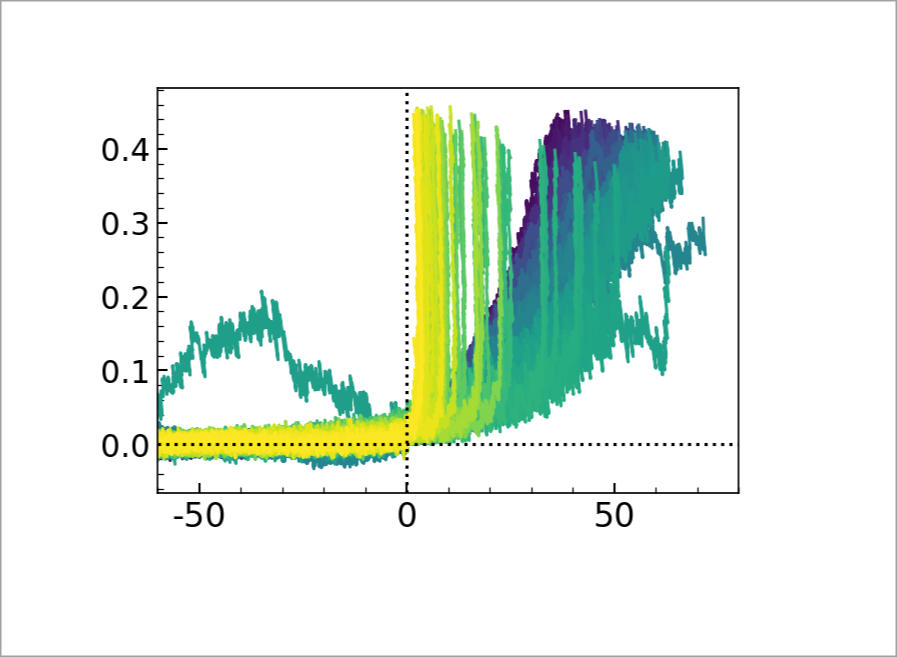
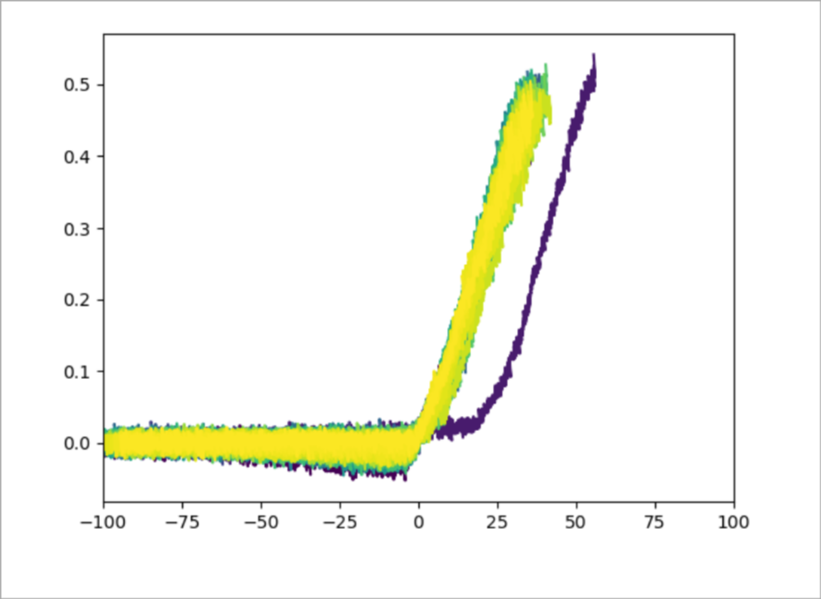
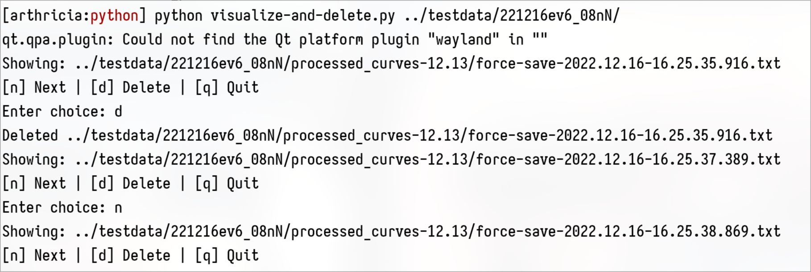
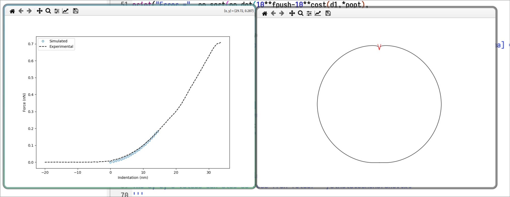

# Table of Contents

1.  [Code Organization](#orgee525de)
2.  [Data organization](#org558e07b)
3.  [JPK-software (convert jpk to csv)](#orgebe0f09)
4.  [Selecting Proper Data](#orgd1dd9f9)
    1.  [Exceptional Cases](#orge908c5b)
    2.  [Additional information](#org2095133)
5.  [Estimation of $\widetilde{K_A}$](#orga66e974)
6.  [Simulation](#orgf02b138)

This documentation should serve as a reference manual for analyzing the data published in the paper (Fredrik Stridfeldt and Hanna Kylhammar and Prattakorn Metem and Vikash Pandey and Vipin Agrawal and Andr{\\'e} G{\\"o}rgens and Doste R Mamand and Oskar Gustafsson and Samir El Andaloussi and Dhrubaditya Mitra and Apurba Dev, 2024).

# Code Organization

The code is organized in the following manner:

    Code/
        ├─ Documentation/
        │                ├─ Documentation.md
        │                ├─ Documentation.pdf
        ├─ src/
        │     ├─ matlab/
        │     │        ├─code1.md
        │     │        ├─code2.md
        │     ├─ python/
        │     │        ├─code1.py
        │     │        ├─code2.py
        │     ├─ readme.txt
        ├─ .gitignore
        ├─ package.json
        ├─ README.md

The `matlab` folder contains all the matlab subroutines and the `python` folder contains the python codes.

# Data organization

The data for the force-distance curve is expected to be arranged in the following manner.

    Data/
        ├─ SampleType1/
        │            ├─ SampleA/
        │            │         ├─ processed_curves-xx/
        │            │         │                     ├─ force-save-{series}.txt
        │            │         ├─ other-files
        │            ├─ SampleB/
        │            │         ├─ processed_curves-xx/
        ├─ SampleType2/
        │            ├─ SampleA/
        │            │         ├─ processed_curves-xx/
        │            │         │                     ├─ force-save-{series}.txt
        │            │         ├─ other-files
        │            ├─ SampleB/
        │            │         ├─ processed_curves-xx/
        │            │         │                     ├─ force-save-{series}.txt
        │            │         ├─ other-files

The `SampleType1` is the sample type e.g. `Wild-Type`. It can be given any name. An example data structure is the following:

    testdata
      └── WT
          ├── 221216ev6_08nN
          │   ├── after-0.3nN.txt
          │   ├── after-0.5nN.txt
          │   ├── before.txt
          │   └── processed_curves-12.13
          │       ├── force-save-2022.12.16-16.25.37.389.txt
          │       ├── force-save-2022.12.16-16.25.41.855.txt
          │       ├── force-save-2022.12.16-16.25.44.855.txt
          │       ....
          └── 221216ev8_08nN
              └── processed_curves-12.13
                  ├── force-save-2022.12.16-16.25.37.389.txt
                  ├── force-save-2022.12.16-16.25.41.855.txt
                  ....

# JPK-software (convert jpk to csv)

It is essential to convert the data which is in `.jpk` to human readable `.csv` form before performing any analysis. Although the software build for the analysis by the provider can be used to some of the analysis we perform, we do this for greater flexibility. The steps followed are as follows:

-   Open the software
-   Select open batch of spectroscopy data
-   Go to the folder and select load
-   <table border="2" cellspacing="0" cellpadding="6" rules="groups" frame="hsides">
    
    
    <colgroup>
    <col  class="org-left" />
    
    <col  class="org-left" />
    </colgroup>
    <tbody>
    <tr>
    <td class="org-left">&#xa0;</td>
    <td class="org-left">&#xa0;</td>
    </tr>
    
    <tr>
    <td class="org-left"></td>
    <td class="org-left"></td>
    </tr>
    
    <tr>
    <td class="org-left"></td>
    <td class="org-left"></td>
    </tr>
    
    <tr>
    <td class="org-left">&#xa0;</td>
    <td class="org-left">&#xa0;</td>
    </tr>
    </tbody>
    </table>

# Selecting Proper Data

**This is the most important step.** Don't populate the data folder with unwanted datasets. **Copy only the data which are supposed to be analyzed.** This has to be done visually. Once the experiment on a particular sample is completed, use the jpk-software to convert the data into the csv format. 

To visualize all the force-distance curves recorded in the experiment use the code `visualize.py`. For execution run

    python visualize.py path/to/folder/containing/processed_curves-*/directory

The output window will show all the curves, where the first indentation will be deep-purple and the last yellow, as shown in the figure below

Ensure all the criterion listed in the SI of (Fredrik Stridfeldt and Hanna Kylhammar and Prattakorn Metem and Vikash Pandey and Vipin Agrawal and Andr{\\'e} G{\\"o}rgens and Doste R Mamand and Oskar Gustafsson and Samir El Andaloussi and Dhrubaditya Mitra and Apurba Dev, 2024) is obeyed. For example the following experiment data is expected to be deleted

## Exceptional Cases

It is possible that only few processed-curve could be erroneous \. This mainly happens during converting the data to csv using the jpk-software. Here these curves should be removed before copying the data into the expected directory. 

To remove the erroneous curve run `visualize-and-delete.py`. The execution is same as before

    python visualize.py path/to/folder/containing/processed_curves-*/directory

The fdc will be plotted sequentially and the unwanted file can be removed by pressing [d]. See the terminal output Figure \.

Write something on height vs RC

## Additional information

All the post-processing data will be generated inside the folder where the `processed-curve*` is stored. In the same folder the metadata for the vesicle is also stored in the filename `vesicle_para.txt`. The content are

    height: 80.0 
    radius: 58.44 
    xmax: 20.0
    shift: 2.0

Height and radius are the height and radius of the membrane. xmax and shift will be explained in the section Simulation. 

# Estimation of $\widetilde{K_A}$

To estimate $\widetilde{K_A}$, use the code `AverageFDCandKA.py`. For execution

    python AverageFDCandKA.py path/to/folder/containing/processed_curves-*/directory/

The output is `KA.txt` with all the KA estimated for individual fdc. The output is dumped
in the directory provided as an input while running the script.

The other output is `AverageFDC.txt` which will store the average FDC.

# Simulation

The details of simulation is given in the Supplementary information section 10.B of (Fredrik Stridfeldt and Hanna Kylhammar and Prattakorn Metem and Vikash Pandey and Vipin Agrawal and Andr{\\'e} G{\\"o}rgens and Doste R Mamand and Oskar Gustafsson and Samir El Andaloussi and Dhrubaditya Mitra and Apurba Dev, 2024).

Use the code `Optimize1dMembrane.py`. The output will be a fitted curve and the membrane as \

Additional parameters required to fit are **shift** = The horizontal correction performed on average fdc and **xmax** = The upper bound for the fitting range. The curve will be fitted from [0+shift to xmax].

Fredrik Stridfeldt and Hanna Kylhammar and Prattakorn Metem and Vikash Pandey and Vipin Agrawal and Andr{\\'e} G{\\"o}rgens and Doste R Mamand and Oskar Gustafsson and Samir El Andaloussi and Dhrubaditya Mitra and Apurba Dev (2024). *Surface adhesion and membrane fluctuations influence the elastic modulus of extracellular vesicles*, bioRxiv.

