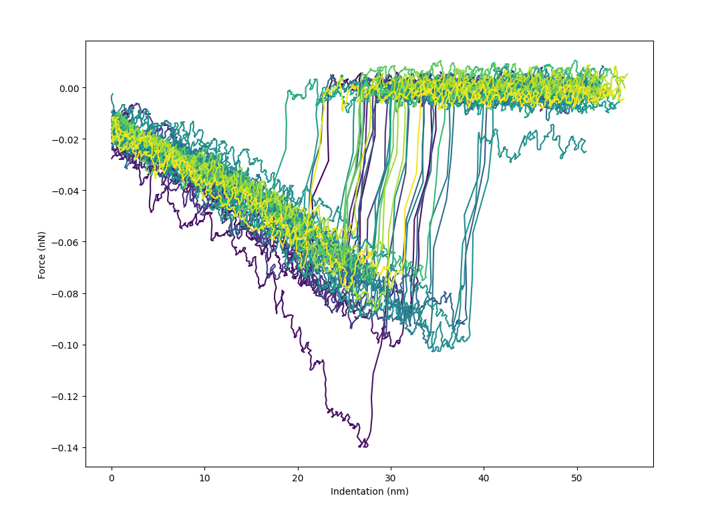
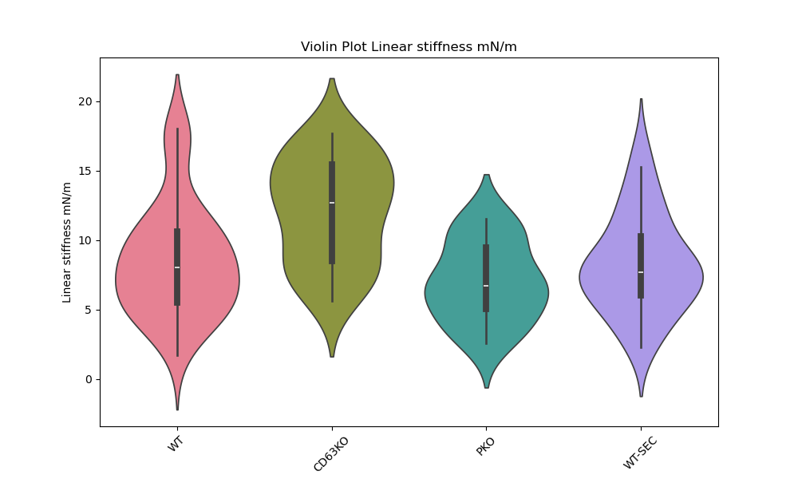
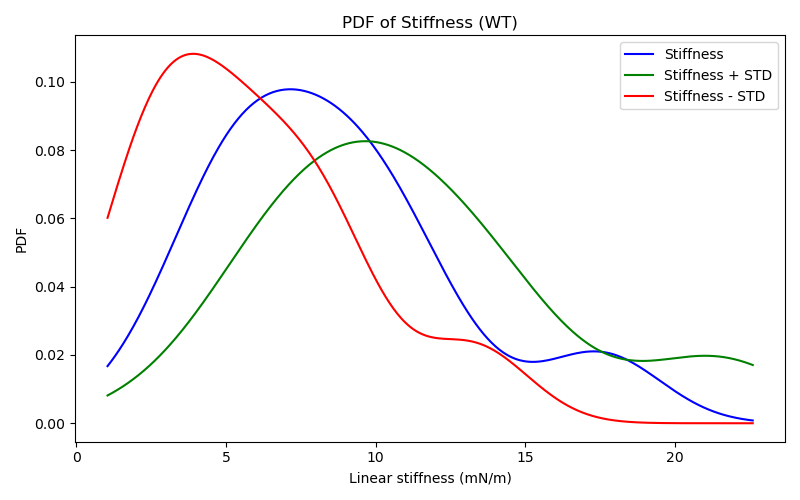

<!-- # Table of Contents -->

<!-- 1.  [Code Organization](#org4d60a9d) -->
<!-- 2.  [Data organization](#org171465f) -->
<!-- 3.  [JPK-software (convert jpk to csv)](#orgb3d5f92) -->
<!-- 4.  [Selecting Proper Data](#org509959b) -->
    <!-- 1.  [Exceptional Cases](#org78489e1) -->
    <!-- 2.  [Additional information](#orgd486408) -->
<!-- 5.  [Estimation of $\widetilde{K_A}$](#orga6e7ac2) -->
<!-- 6.  [Violin Plot and Distribution](#org6df830b) -->
<!-- 7.  [Simulation](#org0573011) -->

This documentation should serve as a reference manual for analyzing the data published in the paper (Force spectroscopy reveals membrane fluctuations andsurface adhesion of extracellular nanovesicles impacttheir elastic behavior).


<a id="org4d60a9d"></a>

# Code Organization

The code is organized in the following manner:

```python
    Code/
        ├─ Documentation/
        │                ├─ Documentation.md
        │                ├─ Documentation.pdf
        ├─ src/
        │     ├─ matlab/
        │     │        ├─code1.md
        │     │        ├─code2.md
        │     ├─ python/
        │     │        ├─code1.py
        │     │        ├─code2.py
        │     ├─ readme.txt
        ├─ .gitignore
        ├─ package.json
        ├─ README.md
```
The `matlab` folder contains all the matlab subroutines and the `python` folder contains the python codes.


<a id="org171465f"></a>

# Data organization

The data for the force-distance curve is expected to be arranged in the following manner.

```python
    Data/
        ├─ SampleType1/
        │            ├─ SampleA/
        │            │         ├─ processed_curves-xx/
        │            │         │                     ├─ force-save-{series}.txt
        │            │         ├─ other-files
        │            ├─ SampleB/
        │            │         ├─ processed_curves-xx/
        ├─ SampleType2/
        │            ├─ SampleA/
        │            │         ├─ processed_curves-xx/
        │            │         │                     ├─ force-save-{series}.txt
        │            │         ├─ other-files
        │            ├─ SampleB/
        │            │         ├─ processed_curves-xx/
        │            │         │                     ├─ force-save-{series}.txt
        │            │         ├─ other-files
```
The `SampleType1` is the sample type e.g. `Wild-Type`. It can be given any name. An example data structure is the following:

```python
    testdata
      └── WT
          ├── 221216ev6_08nN
          │   ├── after-0.3nN.txt
          │   ├── after-0.5nN.txt
          │   ├── before.txt
          │   └── processed_curves-12.13
          │       ├── force-save-2022.12.16-16.25.37.389.txt
          │       ├── force-save-2022.12.16-16.25.41.855.txt
          │       ├── force-save-2022.12.16-16.25.44.855.txt
          │       ....
          └── 221216ev8_08nN
              └── processed_curves-12.13
                  ├── force-save-2022.12.16-16.25.37.389.txt
                  ├── force-save-2022.12.16-16.25.41.855.txt
                  ....
```

<a id="orgb3d5f92"></a>

# JPK-software (convert jpk to csv)

It is essential to convert the data which is in `.jpk` to human readable `.csv` form before performing any analysis. Although the software build for the analysis by the provider can be used to some of the analysis we perform, we do this for greater flexibility. The steps followed are as follows:

-   Open the software
-   Select open batch of spectroscopy data
-   Go to the folder and select load
-   Apply three operators (highlighted on top) viz: correct offset and tilt, fit slope and correct for zero, and correct for bending of tip. The symbols for the same are circled with red.
-   In the correct offset and tilt select the necessary operation on the right.
-   We generally discard the first data curve.
-   Apply the operation to all the curves
-   Once finished export the data. Use the naming convention as discussed above. See pictures below for more clarity.
    
    <table border="2" cellspacing="0" cellpadding="6" rules="groups" frame="hsides">
    
    
    <colgroup>
    <col  class="org-left" />
    
    <col  class="org-left" />
    </colgroup>
    <tbody>
    <tr>
    <td class="org-left">&nbsp;</td>
    <td class="org-left">&nbsp;</td>
    </tr>
    
    <tr>
    <td class="org-left"></td>
    <td class="org-left"></td>
    </tr>
    
    <tr>
    <td class="org-left"></td>
    <td class="org-left"></td>
    </tr>
    
    <tr>
    <td class="org-left">&nbsp;</td>
    <td class="org-left">&nbsp;</td>
    </tr>
    </tbody>
    </table>


<a id="org509959b"></a>

# Selecting Proper Data

**This is the most important step.** Don't populate the data folder with unwanted datasets. **Copy only the data which are supposed to be analyzed.** This has to be done visually. Once the experiment on a particular sample is completed, use the jpk-software to convert the data into the csv format. 

To visualize all the force-distance curves recorded in the experiment use the code `visualize.py`. For execution run
```python
    python visualize.py path/to/folder/containing/processed_curves-*/directory
```
The output window will show all the curves, where the first indentation will be deep-purple and the last yellow, as shown in the figure below


Ensure all the criterion listed in the Supplementary Information (of paper) are met. For example the following experiment data is expected to be deleted


<a id="org78489e1"></a>

## Exceptional Cases

It is possible that only few processed-curve could be erroneous (figure below). This mainly happens during converting the data to csv using the jpk-software. Here these curves should be removed before copying the data into the expected directory. 


To remove the erroneous curve run `visualize-and-delete.py`. The execution is same as before
```python
    python visualize.py path/to/folder/containing/processed_curves-*/directory
```
The fdc will be plotted sequentially and the unwanted file can be removed by pressing [d]. See the terminal output Figure below.


<a id="orgd486408"></a>

## Additional information

All the post-processing data will be generated inside the folder where the `processed-curve*` is stored. In the same folder the metadata for the vesicle is also stored in the filename `vesicle_para.txt`. The content are
```python
    height: 80.0 
    radius: 58.44 
    xmax: 20.0
    shift: 2.0
```
Height and radius are the height and radius of the membrane. xmax and shift will be explained in the section Simulation. 


<a id="orga6e7ac2"></a>

# Estimation of $\widetilde{K_A}$

To estimate $\widetilde{K_A}$, use the code `AverageFDCandKA.py`. For execution
```python
    python AverageFDCandKA.py path/to/folder/containing/processed_curves-*/directory/
```
The output is `KA.txt` with all the KA estimated for individual fdc. The output is dumped
in the directory provided as an input while running the script.

The other output is `AverageFDC.txt` which will store the average FDC.

# Tethers 
To identify tethers and print F/L to a file use the code `TetherandKappa.py`. The F/L is written in the file 'FbyL.txt' inside the folder passed as an argument. To execute the code 
```python
python TetherandKappa.py  path/to/folder/containing/processed_curves*/directory/
```
The output will also be a figure as shown below


**Note** It is important to note that sometimes there are false positives being detected as tethers. Such curves must be removed manually or by tweaking the parameters in the script. 

The F/L is used to determine the bending modulus $\kappa$ after $R_c$ and H is obtained from AFM. 

<a id="org6df830b"></a>

# Violin Plot and Distribution

We present the data using violin plots. After estimating the mean of all the physical quantity of interest we store them in .xlsx file. A representative is given inside Distribution folder. The code inside the folder (`ViolinPlot.py KApdfWT.py`) can be used to make representative figures as shown below. A sample JS divergence estimation is also given in `KApdfWT.py`

<table border="2" cellspacing="0" cellpadding="6" rules="groups" frame="hsides">


<colgroup>
<col  class="org-left" />

<col  class="org-left" />
</colgroup>
<tbody>
<tr>
<td class="org-left">&nbsp;</td>
<td class="org-left">&nbsp;</td>
</tr>

<tr>
<td class="org-left"></td>
<td class="org-left"></td>
</tr>

<tr>
<td class="org-left">&nbsp;</td>
<td class="org-left">&nbsp;</td>
</tr>
</tbody>
</table>

**Note**: The code for the estimation of $\kappa$ is not provided now. 


<a id="org0573011"></a>

# Simulation

The details of simulation is given in the Supplementary information section 10.B of (??, ).

Use the code `Optimize1dMembrane.py`. The output will be a fitted curve and the membrane as \


Additional parameters required to fit are **shift** = The horizontal correction performed on average fdc and **xmax** = The upper bound for the fitting range. The curve will be fitted from [0+shift to xmax].

